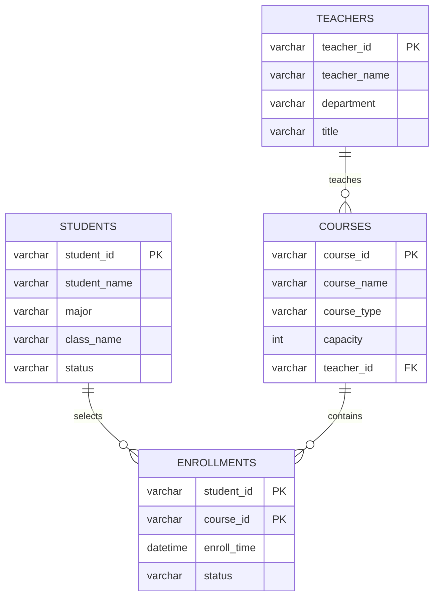

# 高校选课管理系统 - 分析与设计

## 1. 核心数据模型与关系

### 数据表设计

1) `students`
- `student_id` VARCHAR(20) PK
- `student_name` VARCHAR(50)
- `grade` VARCHAR(20)
- `major` VARCHAR(50)
- `class_name` VARCHAR(50)
- `status` VARCHAR(20)
- `created_at` DATETIME

2) `teachers`
- `teacher_id` VARCHAR(20) PK
- `teacher_name` VARCHAR(50)
- `title` VARCHAR(30)
- `department` VARCHAR(50)
- `email` VARCHAR(100)
- `status` VARCHAR(20)

3) `courses`
- `course_id` VARCHAR(20) PK
- `course_name` VARCHAR(50)
- `course_type` VARCHAR(20)
- `capacity` INT
- `teacher_id` VARCHAR(20) FK -> teachers.teacher_id
- `credit` DECIMAL(3,1)
- `semester` VARCHAR(20)
- `status` VARCHAR(20)

4) `enrollments`
- `student_id` VARCHAR(20) PK(联合主键部分) FK -> students.student_id
- `course_id` VARCHAR(20) PK(联合主键部分) FK -> courses.course_id
- `enroll_time` DATETIME
- `source` VARCHAR(20)
- `status` VARCHAR(20)

### 关联关系
- `teachers` 与 `courses`：1 对多（一个教师教授多门课程）。
- `students` 与 `courses`：多对多，通过 `enrollments` 建立关联。
- 为避免评阅环境不支持 Mermaid 渲染，已提供 ER 图渲染截图：`docs/image.png`。

## 2. 并发风险与解决方案

### 选课高峰核心风险
- 超卖：同一课程在高并发下被同时校验“还有余量”，最终写入超过容量。

### 简单可行方案
1. 在事务中读取课程行并加锁：`SELECT ... FOR UPDATE`。
2. 在同一事务内计算已选人数，判断 `count < capacity`。
3. 满足条件才写入 `enrollments`。
4. 对 `(student_id, course_id)` 建立唯一约束，避免重复抢课。

效果：
- 避免并发超卖和重复选课；
- 方案实现成本低，适合课程作业场景。

## 3. 索引设计

### enrollments 表
- 联合主键/唯一索引：`(student_id, course_id)`
  - 目的：防重复选课，支持按学生+课程快速定位。
- 复合普通索引：`(course_id, enroll_time)`
  - 目的：支持“按课程统计人数 + 时间范围筛选”。
- 可选复合索引：`(student_id, enroll_time)`
  - 目的：支持学生选课历史查询、按时间倒序展示。

### courses 表
- 主键索引：`course_id`
  - 目的：课程主键检索。
- 普通索引：`course_type`
  - 目的：加速“专业课/公共课/选修课”筛选。
- 可选复合索引：`(course_type, capacity)`
  - 目的：后台管理中按类型与容量组合筛选时减少回表。
